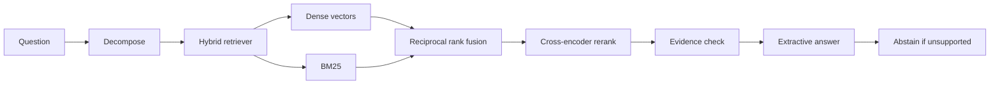

# Agentic RAG Platform

Production-style knowledge assistant: hybrid retrieval, a LangGraph agent, source citations, and an abstention guardrail. Evaluation questions have known relevant chunks, and the numbers in `evaluation/results/` come from `evaluation/run_eval.py`.

The corpus is synthetic company policy text generated by `evaluation/dataset.py`. It is not customer data.

## Architecture



Dense search uses Sentence Transformers and either an in-process matrix or PostgreSQL with pgvector when `DATABASE_URL` is set. BM25 and fusion always run in process. The agent graph is LangGraph and returns LangChain documents.

## Run

```bash
uv sync --extra dev
uv run uvicorn app.main:app --reload
```

- `GET /health` liveness
- `GET /ready` index loaded
- `POST /query` grounded answer with citations
- `POST /ingest` add a chunk
- `GET /stats` latency, abstentions, failures

Set `EMBEDDER=hash` and `RERANKER=overlap` to start without downloading models. The benchmark uses `sentence-transformers/all-MiniLM-L6-v2` and `cross-encoder/ms-marco-MiniLM-L-6-v2`.

## Evaluation

```bash
uv run python -m evaluation.run_eval --chunks 10000
```

Writes `evaluation/results/benchmark.json` and `evaluation/results/BENCHMARK.md`.

Reported metrics:

- Recall@5, Precision@5, MRR for vector-only, BM25, hybrid fusion, and hybrid plus cross-encoder
- Answer relevance F1, lexical groundedness, unsupported-answer rate, abstain rate
- Retrieval P95 and end-to-end P95
- Optional RAGAS faithfulness and answer relevancy when `OPENAI_API_KEY` is set and the `eval` extra is installed: `uv sync --extra eval`

The abstention threshold is chosen on a development split and applied to a disjoint test split. MLflow logs the same metrics to `./mlruns` when the package imports cleanly.

## Docker and AWS

```bash
docker compose up --build
```

Compose starts pgvector and the API. `deploy/ecs-task-definition.json` is an ECS/Fargate spec with a health check and CloudWatch logs. It has not been applied to an AWS account; image and region placeholders are still `<account>` and `<region>`.

## Layout

- `app/retrieval` dense, BM25, fusion, rerank, optional pgvector
- `app/agents` LangGraph decompose → retrieve → validate → generate or abstain
- `app/guardrails.py` lexical support check
- `evaluation/` corpus generator, metrics, benchmark runner
